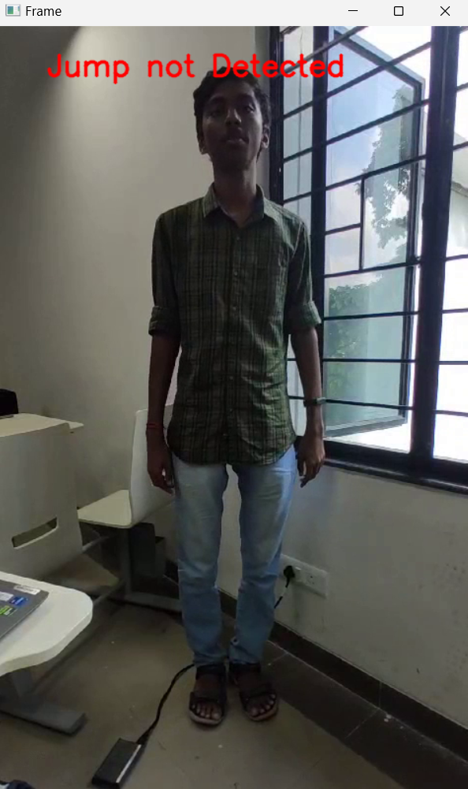
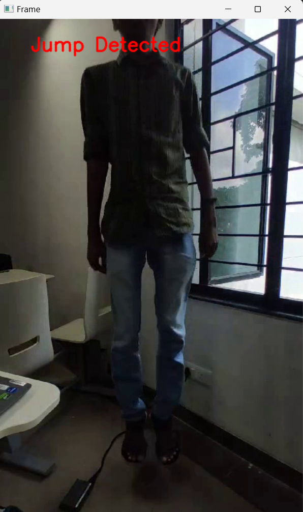
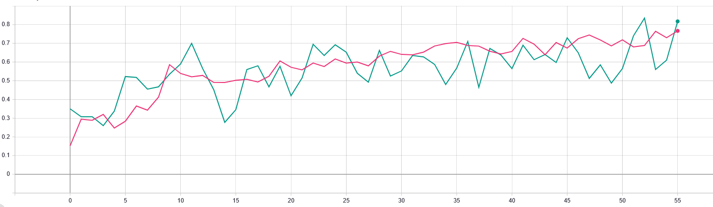
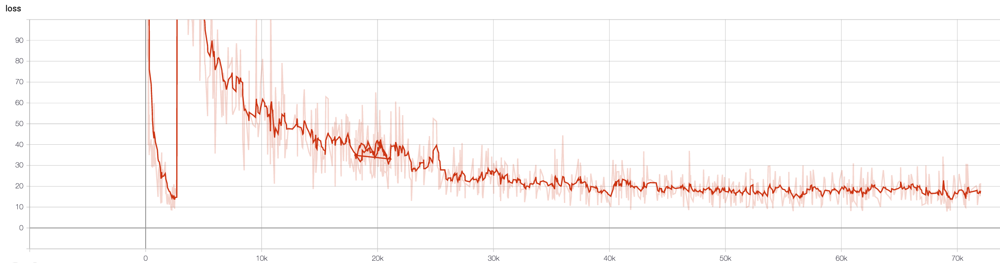

SEM-2 Python Group Project

# 🏃‍♂️ Jump Detection Using Python

A computer vision-based project that detects **jumps in video footage** using background subtraction techniques with OpenCV.

---

## 👥 Group Members

* **Tharun TV** – `23011102109`
* **Prannav R** – `23011102065`
* **Priyajit Biswal** – `23011102068`
* **Rishab Rajeev** – `23011102072`

---

## 🎯 Project Objective

This Python script analyzes video frames to detect when a person jumps by using **background subtraction** and **contour detection**. The goal is to monitor motion patterns and identify jump actions based on the contour’s vertical position.

---

## 🛠️ Requirements

* [OpenCV](https://opencv.org/) (`cv2`)
* [NumPy](https://numpy.org/)

Install via pip:

```bash
pip install opencv-python numpy
```

---

## ⚙️ How It Works

1. **Imports Libraries**: OpenCV for image processing and NumPy for matrix operations.
2. **Background Subtraction**: The first frame of the video is stored as a reference background.
3. **Thresholding & Morphology**:

   * Calculates the absolute difference between the current frame and the background.
   * Applies thresholding and morphological operations (opening and dilation) to clean up noise.
4. **Contour Analysis**:

   * Finds contours of moving objects.
   * Identifies the lowest contour (likely representing the person).
   * If the contour is significantly above the bottom of the frame, it detects it as a jump.
5. **Displays Output**:

   * Real-time feedback: “Jump Detected” or “Jump not Detected” overlayed on video.
6. **Loop Break**:

   * Press `q` to exit the video window.
7. **Cleanup**:

   * Releases the video and closes all OpenCV windows.

---

## 📸 Output Screenshots

### Detection in Action




---

## 📊 Model Training Insights (Pre-Trained Model)

### Accuracy Graph



* 🟢 Green Line: Validation Accuracy
* 🔴 Red Line: Training Accuracy

### Loss Graph



* Initial spike due to unstable gradient
* Gradual decrease post first epoch

---

## 📁 Project Structure

```
├── jump_detection.py         # Main script for detecting jumps
├── output1.png               # Sample output screenshot
├── output2.png               # Sample output screenshot
├── liUl6.png                 # Accuracy graph
├── 8Ln9V-1.png               # Loss graph
└── README.md                 # Project documentation
```

---

## 🧪 Code Snippet

```python
# Check if the lowest contour is high enough to count as a jump
if lowest_contour is not None and lowest_height < frame.shape[0] - 200:
    return True
```

> 🔍 Adjust the height threshold (`200` in this case) based on your video resolution and jump height expectations.

---

## ▶️ How to Run

1. Replace the video path in the code:

```python
cap = cv2.VideoCapture("FILE_PATH")  # Update to your video file path
```

2. Run the script:

```bash
python jump_detection.py
```

3. Press `q` to exit the video window.

---

## 🔮 Future Improvements

* Use pose estimation (e.g., MediaPipe) for better body part tracking
* Integrate machine learning for higher accuracy
* Real-time alert system for sports or fitness monitoring
* Generate statistics or logs of jumps over time

---

## 📝 License

This project was developed as part of academic coursework at **Shiv Nadar University Chennai**.
